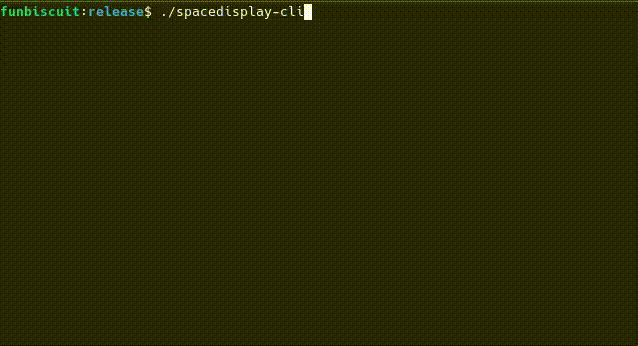

# spacedisplay-rs

[](https://github.com/funbiscuit/spacedisplay-rs/actions/workflows/ci.yaml)

Simple, cross-platform and lightweight terminal app to scan and analyze used disk space



## Features

* Fast scanning and low memory footprint (~45MB per 1M files)
* Delete files from app
* File changes are detected so file system can be modified from outside. On Linux this is limited by inotify limits.
* Rescan directories manually if file changes were not detected
* Terminal UI that allows to use it through SSH
* Small (~1MB on Windows and ~5MB on Linux), self-contained binary without extra dependencies

## Installation

### GitHub Releases

Check out [GitHub Releases](https://github.com/funbiscuit/spacedisplay-rs/releases) page for the latest build.

### Cargo

You can install `spacedisplay` using cargo:

```shell
cargo install spacedisplay
```

## Basic usage

Run the binary in your terminal. If launching without arguments, help screen
will be opened with explanation over controls:

|         Key          | Action                                                     |
|:--------------------:|------------------------------------------------------------|
|        H, F1         | Open Help/Controls screen                                  |
|          F           | Open Files screen                                          |
|          S           | Open scan statistics                                       |
|          Q           | Quit                                                       |
|          N           | Start new scan (opens dialog with available mount points)  |
|        R, F5         | Rescan currently opened directory                          |
|       Up/Down        | Move up and down inside files list                         |
|     Enter, Right     | Open selected directory                                    |
|          D           | Delete selected directory/file (opens confirmation dialog) |
| Esc, Backspace, Left | Go to the parent directory                                 |

Press `N` to open `New scan` dialog and select mount point that should be scanned.
Files screen will be opened after scan is started. Scan statistics dialog can be opened
by pressing `S`.
While files list is opened, all changes in file system are tracked (from external apps too).

Performance
----------

spacedisplay is efficient in both speed and memory footprint. So scan speed is mainly
limited by disk access to gather metadata.
Here are some test results with time in seconds that takes to fully scan root partition.

|   Platform    | Files+Dirs | SpaceDisplay | File Manager |
|:-------------:|:----------:|:------------:|:------------:|
|  Windows 10   |    730K    |    13.2s     |    38.2s     |
|    Kubuntu    |    700K    |     1.8s     |     3.8s     |
| macOS Big Sur |    61K     |     1.4s     |     2.0s     |

In test above default file manager is Explorer on Windows, Dolphin in Kubuntu,
Finder in macOS.

spacedisplay is also lightweight in terms of memory usage.  
To scan 1M files it uses only ~45MB of RAM (measured in Ubuntu 22.04).
